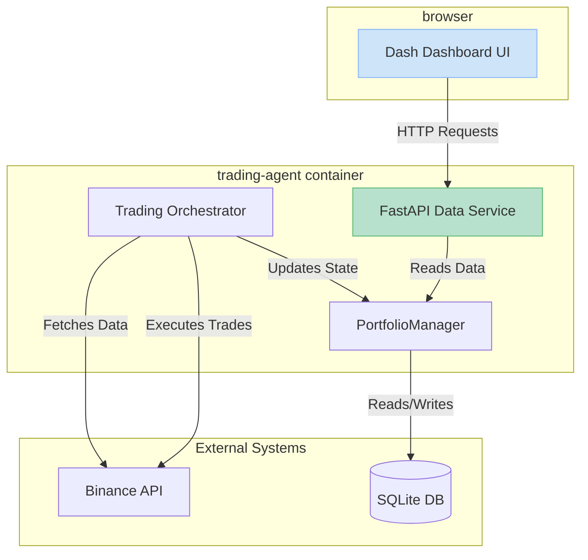

# Binance Trading Agent - Developer Guide

This document is the central technical reference for developers working on the Binance Trading Agent. It covers the system's architecture, development patterns, testing strategies, and deployment procedures.

## 1. Architecture Overview

The system is designed as a modular, agent-based application that follows a strict, sequential workflow for processing and executing trades.

### Core Agent Workflow
The primary data flow follows a clear chain of responsibility:
`MarketDataAgent` → `SignalAgent` → `RiskManagementAgent` → `TradeExecutionAgent`

- **`TradingOrchestrator` (`orchestrator.py`)**: The central coordinator that manages the agent workflow. It ensures each step is executed in the correct order and handles logging and error management.
- **`AsyncTradingOrchestrator` (`async_orchestrator.py`)**: A high-performance version of the orchestrator that uses `asyncio` to run operations concurrently, particularly for fetching data and executing trades across multiple symbols.

### Key Components
- **`api.py` (FastAPI Service)**: A read-only REST API that serves data from the backend components to the web dashboard. This decouples the UI from the core trading logic.
- **`portfolio_manager.py` (SQLAlchemy)**: A database-backed component for tracking all trading positions, calculating P&L, and maintaining a history of all executed trades. It uses SQLite for data persistence.
- **`risk_management_agent.py`**: A sophisticated, multi-layered risk control system. It centralizes all risk validation, from position sizing and drawdown limits to frequency controls.
- **`dashboard/` (Dash UI)**: The web-based user interface for monitoring the system. It is a multi-page Dash application that gets all its data from the FastAPI service.
- **`docker-compose.yml`**: Defines all services, networks, and volumes for the application stack, including the main agent, Redis, and the optional monitoring services (Prometheus/Grafana).
- **`supervisord.conf`**: Manages the processes running inside the `trading-agent` container, including the main application, the Dash UI, and the FastAPI service.

### Data Flow Diagram


## 2. Development Patterns

Adherence to these patterns is critical for maintaining code quality and system stability.

### Asynchronous Operations
For all I/O-bound operations (e.g., API requests), use `async`/`await` to ensure the application remains non-blocking.

```python
# Use the async client for concurrent data fetching
async with AsyncMarketDataAgent() as agent:
    prices = await agent.fetch_prices_batch(['BTCUSDT', 'ETHUSDT'])
```

### Agent Communication
Agents must communicate through standardized data structures (dictionaries or dataclasses), not by calling each other's methods directly. This enforces loose coupling.

```python
# Signal Agent output (a dictionary)
signal_result = {'signal': 'BUY', 'confidence': 0.85, 'indicators': {}}

# Risk Agent consumes the dictionary
risk_result = risk_agent.validate_trade(symbol, signal_result['signal'], quantity, price)
```

### Configuration Management
Configuration is loaded from environment variables, which are defined in the `.env` file and passed into the container by `docker-compose`.

- The `config.py` module provides a centralized interface for accessing configuration values.
- **Priority**: Environment Variable > `.env` file > Default value in code.
- The Binance API URL defaults to the **Testnet**. This should only be changed for production deployment with extreme caution.

### Structured Logging
All log messages should be structured and include a `correlation_id` to allow for easy tracing of a request through the entire system.

```python
correlation_id = f"trade_{datetime.now().strftime('%Y%m%d_%H%M%S_%f')}"
extra = {'correlation_id': correlation_id}
self.logger.info("Starting operation", extra=extra)
```

## 3. Testing Strategy

The project maintains a high standard of testing to ensure reliability.

- **Unit Tests**: Located in `binance_trade_agent/tests/`, these test individual components in isolation. Dependencies are mocked to ensure tests are fast and deterministic.
- **Integration Tests**: Marked with `@pytest.mark.integration`, these tests validate the end-to-end workflow of the agent chain. They may make live calls to the Binance Testnet and are therefore slower.
- **Database Testing**: Tests involving the `PortfolioManager` should use an in-memory SQLite database (`:memory:`) to avoid file system dependencies and ensure test isolation.

### Running Tests
```bash
# Run all tests, including integration tests
docker-compose exec trading-agent pytest

# Run only unit tests (faster)
docker-compose exec trading-agent pytest -m "not integration"

# Run a specific test file
docker-compose exec trading-agent pytest binance_trade_agent/tests/test_portfolio_manager.py
```

## 4. Deployment

The application is designed to be deployed exclusively via Docker.

- **`deploy.sh`**: This script is the primary entry point for deployment.
  - `development`: Builds the development image and starts the services with hot-reloading enabled.
  - `production`: Builds an optimized production image.
  - `monitoring`: Deploys the optional Prometheus and Grafana monitoring stack.

- **Container Processes**: The `trading-agent` container runs multiple processes managed by `supervisord`:
  1. The main trading application (`main.py`).
  2. The Dash UI (`dashboard/run.py`).
  3. The FastAPI data service (`api.py`).

### Rebuilding After Changes
If you make changes to dependencies in `requirements.txt` or to the Dockerfile, you must rebuild the image.

```bash
# Rebuild the image and restart the services
docker-compose build && docker-compose up -d --force-recreate
```

## 5. Database Management

The application uses SQLite for its database, and `alembic` for managing schema migrations.

- **Location**: The database file is located at `/app/data/portfolio.db` inside the container, which is mapped to the `data/` directory on the host.
- **Schema Changes**: If you modify a SQLAlchemy model in `portfolio_manager.py`, you must generate a new migration script.
  ```bash
  # Access the container
  docker-compose exec trading-agent /bin/bash

  # Generate a new migration script
  alembic revision --autogenerate -m "Your migration message"

  # Apply the migration
  alembic upgrade head
  ```

This guide provides the essential information for developing and maintaining the Binance Trading Agent. For a history of design decisions, refer to the `DESIGN_LOG.md`.
